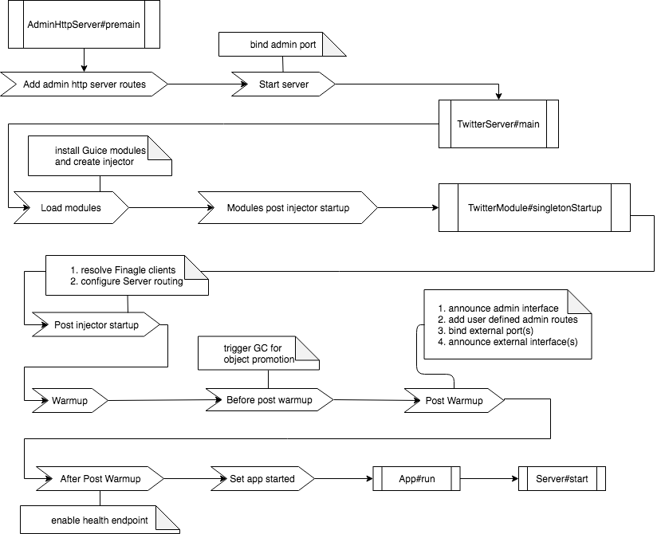

.. _lifecycle:

Application and Server Lifecycle
================================

Finatra establishes an ordered lifecycle when creating a `c.t.app.App <https://twitter.github.io/util/docs/com/twitter/app/App.html>`__ or
a `c.t.server.TwitterServer <https://github.com/twitter/twitter-server/blob/develop/server/src/main/scala/com/twitter/server/TwitterServer.scala>`__
and provides methods which can be implemented for running or starting core logic.

This is done for several reasons:

- To ensure that `flag <./flags.html>`__ parsing and `module <./modules.html>`__ installation to
  build the object graph is done in the correct order such that the injector is properly configured
  before a user attempts attempts to access flags.

- Ensure that object promotion and garbage collection is properly handled *before* accepting traffic
  to a server.

- Expose any external interface *before* reporting a server is "healthy". Otherwise a server may
  report it is healthy before binding to a port — which may fail. Depending on how monitoring is
  configured (typically done by monitoring the `HTTP Admin Interface <https://twitter.github.io/twitter-server/Features.html#admin-http-interface>`__
  `/health <https://twitter.github.io/twitter-server/Features.html#lifecycle-management>`__ endpoint
  on some frequency) it could be some interval before the server is recognized as unhealthy when in
  fact it did not start properly as it could not bind to a port.

Thus you do not have access to the `App <https://github.com/twitter/util/blob/9fa550a269d2287b24e94921a352ba954f9f4bfb/util-app/src/main/scala/com/twitter/app/App.scala#L24>`__
or `TwitterServer <https://github.com/twitter/twitter-server/blob/5fea9c2a6220ab9bbdb449c99c946e2aef322e7d/server/src/main/scala/com/twitter/server/TwitterServer.scala#L93>`__
`main()` method. Instead, any logic should be contained in overriding an ``@Lifecycle``-annotated
method or in the application or server callbacks.

.. caution::

   If you override an ``@Lifecycle``-annotated method you **MUST** first call
   `super.lifecycleMethod()` in your override to ensure that framework lifecycle events happen
   accordingly.

Choosing between TwitterServer and App
--------------------------------------
See the `TwitterServer v. App comparison chart <./comparison.html>`__ to decide
between an App or TwitterServer.

See the `Creating an injectable App <../app/index.html>`__ and
`Creating an injectable TwitterServer <../twitter-server/index.html>`__ sections for more information.

|c.t.app.App|_ Lifecycle
------------------------

Finatra servers are, at their base, |c.t.app.App|_ applications. Therefore it will help to first
cover the |c.t.app.App|_ lifecycle.

When writing a |c.t.app.App|_, you extend the |c.t.app.App|_ trait and place your application logic
inside of a public `main()` method.

.. code:: Scala

    import com.twitter.app.App

    class MyApp extends App {
        val n = flag("n", 100, "Number of items to process")

        def main(): Unit = {
          for (i <- 0 until n()) process(i)
        }
    }

|c.t.app.App|_ provides ways to tie into it's lifecycle by allowing the user to register logic for
different lifecycle phases. E.g., to run logic in the `init` lifecycle phase, the user can call
the `init` function passing a callback to run. `App` collects every call to the `init` function and
will run the callbacks in the order added during the `init` lifecycle phase.

.. code:: Scala

    import com.twitter.app.App

    class MyApp extends App {

        init {
            // initialization logic
        }

        premain {
            // logic to run right before main()
        }

        def main(): Unit = {
            // your application logic here
        }

        postmain {
            // logic to run right after main()
        }

        onExit {
            // closing logic
        }

        closeOnExitLast(MyClosable) // final closing logic
    }

Additional hooks are `premain`, `postmain`, `onExit` and `closeOnExitLast()`, as shown above.

The lifecycle could thus be represented:

.. code:: shell

    App#main() -->
    App#nonExitingMain() -->
        bind LoadService bindings
        run all init {} blocks
        App#parseArgs() // read command line args into Flags
        run all premain {} blocks
        run all defined main() methods
        run all postmain {} blocks
        App#close() -->
            run all onExit {} blocks
            run all Closables registered via closeOnExitLast()

|c.t.inject.app.App|_ Lifecycle
-------------------------------

The Finatra |c.t.inject.app.App|_ extends the |c.t.app.App|_ lifecycle by adding more structure to the
defined `main()` method.

The lifecycle for a Finatra "injectable" App |c.t.inject.app.App|_ can be described:

.. code:: shell

    App#main() -->
    App#nonExitingMain() -->
        bind LoadService bindings
        run all init {} blocks
        App#parseArgs() // read command line args into Flags
        run all premain {} blocks
        c.t.inject.app.App#main() -->
            load/install modules
            modules#postInjectorStartup()
            postInjectorStartup()
            warmup()
            beforePostWarmup()
            postWarmup()
            afterPostwarmup()
            modules#postWarmupComplete()
            register application started
            c.t.inject.app.App#run()
        run all postmain {} blocks
        App#close() -->
            run all onExit {} blocks
            run all Closables registered via closeOnExitLast()

For more information on creating an "injectable" App with Finatra, see the documentation
`here <../app/index.html>`__.

|c.t.server.TwitterServer|_ Lifecycle
-------------------------------------

|c.t.server.TwitterServer|_ is an extension of |c.t.app.App|_ and thus inherits the `c.t.app.App lifecycle <#c-t-app-app-lifecycle>`_,
but adds the ability to include "warmup" lifecycle phases which are just a refinement of
the defined `main()` phase of the |c.t.app.App|_ lifecycle. That is, the
|c.t.server.Lifecycle.Warmup|_ trait exposes two methods, `prebindWarmup` and `warmupComplete`.

These methods are provided **for the user to call** when they make sense typically at points in the
user defined `main()` method before awaiting on the external interface.

The idea being that within your user defined `main()` method you may want to have logic to warmup
the server before accepting traffic on any defined external interface. By default the `prebindWarmup`
method attempts to run a `System.gc` in order to promote objects to old gen (in an attempt to incur a
GC pause *before* your server accepts any traffic).

Users then have a way to signal that warmup is done and the server is now ready to start
accepting traffic. This is done by calling `warmupComplete()`.

To add these phases, users would mix-in the |c.t.server.Lifecycle.Warmup|_ trait into their
|c.t.server.TwitterServer|_ extension.

|c.t.inject.server.TwitterServer|_ Lifecycle
--------------------------------------------

Finatra defines an "injectable" TwitterServer, |c.t.inject.server.TwitterServer|_ which itself is an
extension of |c.t.server.TwitterServer|_ and the Finatra "injectable" App, |c.t.inject.app.App|_.

The Finatra "injectable" TwitterServer, |c.t.inject.server.TwitterServer|_ mixes in the
|c.t.server.Lifecycle.Warmup|_ trait by default to ensure that warmup is performed where most applicable
and further refines the warmup lifecycle as described in the next section.

For more information on creating an "injectable" TwitterServer with Finatra, see the documentation
`here <../twitter-server/index.html>`__.

Server Startup Lifecycle
~~~~~~~~~~~~~~~~~~~~~~~~

Finatra servers inherit the |c.t.app.App|_ lifecycle and, as mentioned, also mix-in the TwitterServer
|c.t.server.Lifecycle.Warmup|_ trait. On top of that, Finatra further refines the lifecycle by adding
more defined phases. These phases all run within a defined `main()` and thus in the "main" |c.t.app.App|_
lifecycle phase and is intended to ensure that the underlying dependency injection framework is
properly instantiated, all Twitter Util `Flags <./flags.html>`__ are properly parsed, external
interfaces are properly bound and the application is correctly started with minimal intervention
needed on the part of the implementor.

In text, at a high-level, the start-up lifecycle of a Finatra server looks like:

.. code:: shell

    App#main() -->
    App#nonExitingMain() -->
        bind LoadService bindings
        run all init {} blocks
        App#parseArgs() // read command line args into Flags
        run all premain {} blocks -->
            add routes to TwitterServer AdminHttpServer
            bind interface and start TwitterServer AdminHttpServer
        c.t.inject.server.TwitterServer#main() -->
            c.t.inject.app.App#main() -->
                load/install modules
                modules#postInjectorStartup()
                postInjectorStartup() -->
                    resolve finagle clients
                    setup()
                warmup()
                beforePostWarmup() -->
                    Lifecycle#prebindWarmup()
                postWarmup() -->
                    announce TwitterServer AdminHttpServer interface
                    bind external interfaces
                    announce external interfaces
                afterPostwarmup() -->
                    Lifecycle#warmupComplete()
                modules#postWarmupComplete()
                register application started
                c.t.inject.app.App#run() -->
                    c.t.inject.server.TwitterServer#start()
            block on awaitables
        run all postmain {} blocks
        App#close() -->
            run all onExit {} blocks
            run all Closables registered via closeOnExitLast()

Visually:

Server Shutdown Lifecycle
~~~~~~~~~~~~~~~~~~~~~~~~~

Upon *graceful* shutdown of an application or a server, all registered `onExit`, `closeOnExit`, and
`closeOnExitLast` blocks are executed. See
`c.t.app.App#exits <https://github.com/twitter/util/blob/9fa550a269d2287b24e94921a352ba954f9f4bfb/util-app/src/main/scala/com/twitter/app/App.scala#L72>`__
and `c.t.app.App#lastExits <https://github.com/twitter/util/blob/bf47b55ff45a31bbd541f66257f2244df5c35f5b/util-app/src/main/scala/com/twitter/app/App.scala#L86>`_.

For a server, this includes closing the `TwitterServer <https://github.com/twitter/twitter-server>`__
`HTTP Admin Interface <https://twitter.github.io/twitter-server/Features.html#admin-http-interface>`__
and shutting down and closing all installed modules. For extensions of the
`HttpServer <../http/server.html>`__ or `ThriftServer <../thrift/server.html>`__ traits this also
includes closing any external interfaces.

.. admonition:: Important

   Note that the order of execution for all registered `onExit` and `closeOnExit` blocks is not
   guaranteed as they are executed on graceful shutdown roughly in parallel. Thus it is up to
   implementors to enforce any desired ordering.

For example, you have code which is reading from a queue (via a "subscriber"), transforming the
data, and then publishing (via a "publisher") to another queue. When the main application is exiting
you most likely want to close the "subscriber" first to ensure that you transform and publish all
available data before closing the "publisher".

Assuming, that both objects are a |c.t.util.Closable|_ type, a simple way to close them would be:

.. code:: scala

     closeOnExit(subscriber)
     closeOnExit(publisher)

However, the "subscriber" and the "publisher" would close roughly in parallel
which could lead to data inconsistencies in your server if the "subscriber" is still reading before
the "publisher" has closed.

Ordering `onExit` and `closeOnExit` functions?
^^^^^^^^^^^^^^^^^^^^^^^^^^^^^^^^^^^^^^^^^^^^^^

Assuming, that the `#close()` method of both returns `Future[Unit]`, e.g. like a |c.t.util.Closable|_,
a way of doing this could be:

.. code:: scala

    onExit {
      Await.result(subscriber.close(defaultCloseGracePeriod))
      Await.result(publisher.close(defaultCloseGracePeriod))
    }

where the `defaultCloseGracePeriod` is the `c.t.app.App#defaultCloseGracePeriod <https://github.com/twitter/util/blob/bf47b55ff45a31bbd541f66257f2244df5c35f5b/util-app/src/main/scala/com/twitter/app/App.scala#L110>`__
function.

In the above example we simply await on the `#close()` of the "subscriber" first and then the
`#close()` of the "publisher" thus ensuring that the "subscriber" will close before the "publisher".

However, we are not providing a timeout to the `Await.result`, which we should ideally do as
well since we do not want to accidentally block our server shutdown if the `defaultCloseGracePeriod`
is set to something high or infinite (e.g., `Time.Top <https://github.com/twitter/util/blob/bf47b55ff45a31bbd541f66257f2244df5c35f5b/util-core/src/main/scala/com/twitter/util/Time.scala#L302>`__).

But if we don't know the configured value of the  `defaultCloseGracePeriod` this makes things
complicated. We could just hardcode a value for the Await, or not use the `defaultCloseGracePeriod`:

.. code:: scala

    onExit {
      Await.result(subscriber.close(defaultCloseGracePeriod), 5.seconds)
      Await.result(publisher.close(defaultCloseGracePeriod), 5.seconds)
    }

    ...

    onExit {
      Await.result(subscriber.close(4.seconds), 5.seconds)
      Await.result(publisher.close(4.seconds), 5.seconds)
    }

However, this is obviously not ideal and there is an easier way. You can enforce the ordering of
closing Closables by using `closeOnExitLast`.

A |c.t.util.Closable|_ passed to `closeOnExitLast` will be closed *after* all `onExit` and
`closeOnExit` functions are executed. E.g.,

.. code:: scala

     closeOnExit(subscriber)
     closeOnExitLast(publisher)

In this code the "publisher" is guaranteed be closed **after** the "subscriber".

.. note:: All the exit functions: `onExit`, `closeOnExit`, and `closeOnExitLast` use the
    `defaultCloseGracePeriod` as their close "deadline" and will raise a `TimeoutException` if
    all the `exits` (collected `onExit`, `closeOnExit` functions) do not close within the deadline.
    And if the `lastExits` (collected `closeOnExitLast` functions) do not close within the deadline.

If you have multiple |c.t.util.Closable|_ objects you want to close in parallel and one you want to
close after all the others, you could do:

.. code:: scala

     closeOnExit(subscriberA)
     closeOnExit(subscriberB)
     closeOnExit(subscriberC)
     closeOnExitLast(publisher)

The "publisher" is guaranteed be closed **after** the closing of "subscriberA", "subscriberB", and
"subscriberC".

What to do if you don't have a |c.t.util.Closable|_?
^^^^^^^^^^^^^^^^^^^^^^^^^^^^^^^^^^^^^^^^^^^^^^^^^^^^

You can simply use the `onExit` block to perform any shutdown logic, or you can wrap a function in
a |c.t.util.Closable|_ to be passed to `closeOnExit` or `closeOnExitLast`.

For example:

.. code:: scala

    onExit {
       DatabaseConnection.drain()
       Await.result(someFutureOperation, 2.seconds)
    }

    closeOnExit {
      Closable.make { deadline =>
       prepWork.start()
       anotherFutureOperation
      }
    }

    closeOnExitLast {
      Closable.make { deadline =>
        queue.blockingStop(deadline)
        Future.Unit
      }
    }

You can also wrap multiple functions in a Closable:

.. code:: scala

    closeOnExit {
       Closable.make { deadline =>
         database.drain()
         fileCleanUp.do()
         pushData(deadline)
         Future.Unit
       }
    }

Again the code in `onExit` and `closeOnExit` will be run in parallel and guaranteed to close
before the functions in `closeOnExitLast`.

.. note:: Multiple `closeOnExitLast` Closables will be closed in parallel with each other but
    **after** all `onExit` and `closeOnExit` functions have closed.

Modules
-------

Modules provide hooks into the Lifecycle as well that allow instances being provided to the object
graph to be plugged into the overall application or server lifecycle. See the
`Module Lifecycle <../getting-started/modules.html#module-lifecycle>`__ section for more information.

More Information
----------------

As noted in the diagram in the `Startup <#startup>`__ section the lifecycle or an application can be
non-trivial -- especially in the case of a `TwitterServer <https://github.com/twitter/twitter-server>`__.

For more information on how to create an injectable `c.t.app.App <https://twitter.github.io/util/docs/com/twitter/app/App.html>`__
or a `c.t.server.TwitterServer <https://github.com/twitter/twitter-server/blob/develop/server/src/main/scala/com/twitter/server/TwitterServer.scala>`__
see the `Creating an injectable App <../app/index.html>`__ and
`Creating an injectable TwitterServer <../twitter-server/index.html>`__ sections.

.. |c.t.util.Closable| replace:: `c.t.util.Closable`
.. _c.t.util.Closable: https://github.com/twitter/util/blob/develop/util-core/src/main/scala/com/twitter/util/Closable.scala

.. |c.t.server.Lifecycle.Warmup| replace:: `c.t.server.Lifecycle.Warmup`
.. _c.t.server.Lifecycle.Warmup: https://github.com/twitter/twitter-server/blob/7d59c1bd46b2d96e4d0056f7860ca0344fe69247/server/src/main/scala/com/twitter/server/Lifecycle.scala#L85

.. |c.t.app.App| replace:: `c.t.app.App`
.. _c.t.app.App: https://github.com/twitter/util/blob/develop/util-app/src/main/scala/com/twitter/app/App.scala

.. |c.t.inject.app.App| replace:: `c.t.inject.app.App`
.. _c.t.inject.app.App: https://github.com/twitter/finatra/blob/develop/inject/inject-app/src/main/scala/com/twitter/inject/app/App.scala

.. |c.t.server.TwitterServer| replace:: `c.t.server.TwitterServer`
.. _c.t.server.TwitterServer: https://github.com/twitter/twitter-server/blob/develop/server/src/main/scala/com/twitter/server/TwitterServer.scala

.. |c.t.inject.server.TwitterServer| replace:: `c.t.inject.server.TwitterServer`
.. _c.t.inject.server.TwitterServer: https://github.com/twitter/finatra/blob/develop/inject/inject-server/src/main/scala/com/twitter/inject/server/TwitterServer.scala
